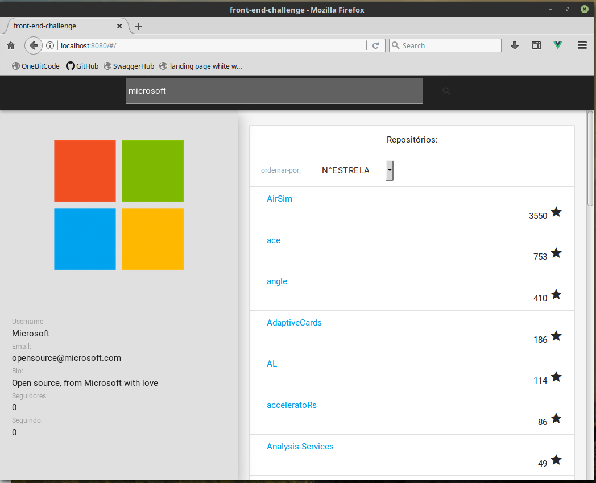

# front-end-challenge

Aplicação client-side que busca, por meio de uma API, os repositórios mais populares de um determinado usuário no github.

# Tecnologias Usadas
- Vue/Vuex
- Materialize
- Sass

<a href="https://frontendchallenge-a63c9.firebaseapp.com">
    Demo 
</a>
